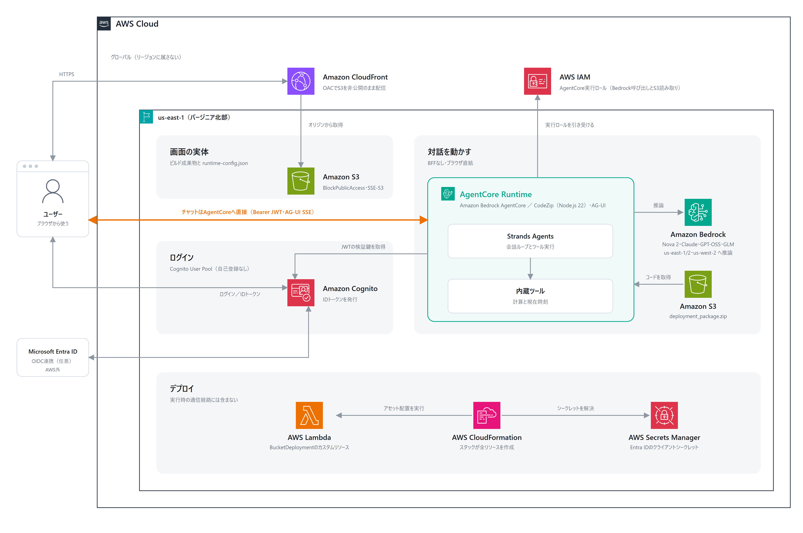

# Workmate AG-UI CodeZip Direct

既存UIを維持しながら、BFFとデータベースを外し、ブラウザからAmazon Bedrock AgentCore Runtimeへ直接接続する最小構成です。RuntimeはNode.js 22のCodeZipです。

> **このリポジトリは研究・学習用途のサンプルであり、プロダクションレディではありません。**
> AgentCore RuntimeへのブラウザからのAG-UI直接接続を検証することが目的です。
> レート制限、WAF、セキュリティレスポンスヘッダー、アクセスログ、監査証跡を実装していません。
> Microsoft Entra IDとのSSO連携は実テナントで疎通まで確認済みですが、管理者アカウント1件での確認にとどまります。
> そのまま業務利用しないでください。詳細は[セキュリティ上の注意と既知の制約](doc/security-notes.md)を参照してください。

## 構成図



## 構成

```text
Browser
  -> CloudFront -> private S3 (React / Vite)
  -> Cognito User Pool (email/password)
     -> optional: Microsoft Entra ID (OIDC)
  -> AgentCore Runtime (Bearer JWT / AG-UI SSE)
       -> Bedrock models
       -> Bedrock Knowledge Base SAT1YRPPIF (Retrieve)
       -> AgentCore Gateway (Bearer JWT / MCP)
            -> Lambda support-directory tool
       -> AgentCore Memory
            -> short-term chat events (30 days)
            -> user-scoped facts / preferences

CloudFormation / CDK
  -> private S3 for CodeZip
  -> BucketDeployment uploads deployment_package.zip
  -> AWS::BedrockAgentCore::Runtime
  -> AgentCore Gateway / Lambda target
  -> AgentCore Memory / KMS key
```

含めないもの:

- BFF、Web Lambda、Lambda Function URL（GatewayのツールLambdaは含む）
- DynamoDB、PostgreSQL、RDS
- 外部データベースや外部セッションストア
- 匿名ユーザー構成

ブラウザとRuntimeの間にLambda/BFFはありません。LambdaはAgentCore GatewayがMCPツールを実行するときだけ呼び出します。CDKのS3デプロイ用カスタムリソースLambdaはCloudFormation実行時だけ動作します。

## Gatewayツール

Runtimeは、AgentCore Runtimeで検証済みのCognitoアクセストークンをAgentCore Gatewayへ引き継ぎ、StrandsのMCPクライアントとして接続します。Gatewayも同じUser PoolとApp ClientでJWTを検証し、Gatewayの実行ロールがLambdaターゲットを呼び出します。

サンプルの`lookup_support_contact`は、`sales`、`support`、`billing`のいずれかを受け取り、固定の問い合わせメールアドレスと営業時間を返す読み取り専用ツールです。入力スキーマはGatewayで公開し、Lambdaでも許可値を検証します。

## Knowledge Base検索ツール

組み込みの`search_knowledge_base`は、既存のBedrock Knowledge Base `SAT1YRPPIF`へRuntimeから`Retrieve`を直接実行します。検索語と取得件数（1～10件、既定5件）を受け取り、本文、スコア、文書ID、メタデータ、出典位置を返します。Runtime実行ロールの`bedrock:Retrieve`はこのKnowledge Base ARNだけに限定しています。Knowledge Base本体やデータソースは本スタックで作成・変更・削除しません。

## UIと履歴

チャット履歴はAgentCore Memoryの短期記憶へ30日間保存し、再読み込み後も復元します。Cognito JWTの`sub`を`actorId`、チャットの`threadId`を`sessionId`に使うため、履歴は認証ユーザーごとに分離されます。完了した各ターンをユーザー発言とアシスタント応答の対で保存します。

長期記憶はユーザー単位の事実と好みを非同期に抽出し、後続チャットで関連する記憶だけを検索して応答コンテキストへ加えます。プロジェクト単位の記憶、プロジェクトの永続化、フィードバック保存は対象外です。チャット名変更とアーカイブもブラウザタブ内だけの状態です。

## 必要環境

- WSL2 Ubuntu
- Node.js 24 / npm 11（Runtime成果物はNode.js 22対象）
- AWS CLI v2
- AWS CDK bootstrap済みの`us-east-1`
- Amazon Bedrockで使用モデルを利用可能なアカウント

Dockerは不要です。CodeZipと静的フロントエンドだけをビルドします。

## 手順書

ローカル検証、デプロイ、Microsoft Entra ID連携、削除の手順は[デプロイ手順書](doc/deployment-guide.md)にまとめています。

2回目以降のデプロイでは、Git管理外の`scripts/deploy-config.psd1`へAWSプロファイル、リージョン、認証、ログ、デバッグの設定を保存し、次のコマンドを使用できます。必須値が空の場合はビルド前に停止します。AWSプロファイルの初期値は`default`です。

```powershell
.\scripts\Deploy-Workmate.ps1
```

ソースコード、インフラ、Runtime、Gatewayツール、テスト、生成物の配置意図は[フォルダ構成](doc/folder-structure.md)を参照してください。

実装済み機能の詳細は[Runtime機能一覧](doc/runtime-features.md)と[UI機能一覧](doc/ui-features.md)を参照してください。

## ログ

AgentCore Runtimeのログを、保持期間つきのCloudWatch Logsロググループへ配信します。ロググループ名はスタック出力`RuntimeLogGroupName`で確認できます。

保持期間の既定は3日です。デプロイ時に変更できます。指定できるのはCloudWatch Logsが受け付ける日数（1、3、5、7、14、30、…）だけで、それ以外はsynthが停止します。

`scripts/deploy-config.psd1`の`LogRetentionDays`で指定します。

配信するのは`APPLICATION_LOGS`（エージェント実行時のログ）と`USAGE_LOGS`（セッション単位の消費量）です。

ブラウザ側のAG-UI通信を調べる場合は、デプロイ時に`-c webDebugMode=on`を指定できます。既定はOFFです。Consoleへ履歴、メッセージ、ツール引数・結果を含む診断情報が出るため、一時的な調査だけに使用し、終了後は`-c webDebugMode=off`で再デプロイしてください。詳しい手順は[デプロイ手順書の「ブラウザデバッグモード」](doc/deployment-guide.md#ブラウザデバッグモード)を参照してください。

Runtimeは1行1JSONの構造化ログを出します。CloudWatch Logs Insightsで`event`や`threadId`で絞り込めます。

| 種別 | 出力内容 | 無効化するコンテキスト |
|---|---|---|
| `request` | 受信したAG-UI入力。**利用者のメッセージ本文を含む** | `-c runtimeLogRequest=off` |
| `model` | 応答完了時の本文、思考の文字数、所要時間。**モデルの応答本文を含む** | `-c runtimeLogModel=off` |
| `tool` | ツール名、引数、実行結果 | `-c runtimeLogTool=off` |
| エラー | 失敗時のメッセージとスタック | 無効化できない |

> **既定では利用者の入力とモデルの応答がそのままCloudWatch Logsへ残ります。**
> 個人情報や秘密情報を扱う場合は`runtimeLogRequest`と`runtimeLogModel`を`off`にしてください。
> 本番ではロググループの暗号化、アクセス制御、Data Protection policyも併せて設計します。

X-Rayトレースとスパン（CloudWatch GenAI Observability）は含めていません。AWSアカウント・リージョン単位でCloudWatch Transaction Searchを有効にする必要があり、このスタックの範囲外としています。

## CDKで作る主なリソース

- Cognito User Pool / App Client / Cognito domain
- Runtimeログ用のCloudWatch Logsロググループと配信設定
- オプションのEntra OIDC Identity Provider
- 非公開Web S3バケット / CloudFront OAC Distribution
- 非公開CodeZip S3バケット / BucketDeployment
- AgentCore Runtime実行ロール
- AgentCore CodeZip Runtime（AGUI、Cognito JWT authorizer）
- 既存Knowledge Base `SAT1YRPPIF`への参照設定と最小権限
- AgentCore Gateway（MCP、Cognito JWT authorizer）/ 問い合わせ先検索Lambdaターゲット
- AgentCore Memory（短期履歴、個人の事実・好み）/ 暗号化用KMSキー

`RuntimeArtifactsBucketName`をCloudFormation outputへ出すため、CDKが作成したS3へZIPが投入されたことを確認できます。

## セキュリティ上の注意

**このサンプルには未実装の防御があります。** 認証境界として機能している部分、未実装の防御、検証済みの範囲を[セキュリティ上の注意と既知の制約](doc/security-notes.md)にまとめています。利用前に必ず確認してください。

脅威モデル（STRIDE）、実装済みの統制、責任分界、データ分類、リスク評価は[セキュリティドキュメント](SECURITY.md)にまとめています。

## 既知の不具合

### Claude Sonnet 5はアカウントによって実行を拒否される

モデル選択肢に`Claude Sonnet 5`を含めていますが、AWSアカウントによっては実行時に次のエラーになります。

```text
AccessDeniedException: anthropic.claude-sonnet-5 is not available for this account.
You can explore other available models on Amazon Bedrock.
For additional access options, contact AWS Sales.
```

2026-08-16時点の検証では、対象アカウントで次がすべて満たされていてもこのエラーが発生しました。

- `GetFoundationModelAvailability`が`agreementAvailability=AVAILABLE`、`authorizationStatus=AUTHORIZED`、`entitlementAvailability=AVAILABLE`、`regionAvailability=AVAILABLE`
- Anthropic First Time Use（FTU）用途フォーム登録済み
- Runtime実行ロールに推論プロファイルARNと基盤モデルARNの両方を許可済み
- US Geo Inference Profile（`us.anthropic.claude-sonnet-5`）を指定

`thinking`と`output_config`を含まない最小のConverseリクエストでも、BedrockコンソールのPlaygroundからUS Geo Inference Profileを選んだ場合でも同じ結果でした。したがってリクエスト形式、Agreement、FTU用途フォーム、IAM、Inference Profileのいずれでも説明できません。状態APIに現れないアカウント単位の提供制限が適用されています。

回避策はSonnet 5以外のモデルを選ぶことです。解消にはAWS SalesまたはAWS Supportへの問い合わせが必要で、その際はリージョン、モデルID`anthropic.claude-sonnet-5`、Inference Profile ID`us.anthropic.claude-sonnet-5`、発生日時を伝えます。

この症状をAgentCore Runtimeの障害や`thinking`設定の不整合と取り違えないでください。`GetFoundationModelAvailability`の結果だけではSonnet 5を選択可能と判定できません。

## 補足: PowerShellで`npm run`の引数がCDKへ渡らない場合

本READMEのコマンドは既定の`npm`を前提としています。通常はそのまま動作します。以下は、PowerShellで`npm`がラップされている環境に限って起きる問題への注記です。

safe-chainのような一部のツールは、PowerShellプロファイルで`npm`を**関数**として定義します。PowerShellは関数への引数束縛時に`--`を区切り記号として取り除くため、`npm run deploy -- -c key=value`と書いても`--`が消え、`-c`がnpm自身の`--call`オプションとして解釈されます。症状は2つあります。

- npmが`npm_config_call`を子プロセスへ伝播し、`cdk.json`の`npx tsx infrastructure/app.ts`が`npm error code EUSAGE`で失敗する
- `-c`を`--context`へ置き換えると、npmが`Unknown cli config`として黙って落とし、値だけが`cdk deploy`の位置引数として渡る。**エラーにならないまま、CDKコンテキストが適用されずにデプロイが完了する**

`Get-Command npm -All`で`Function`が現れる場合はこの状況です。回避するには`npm.cmd`を使います。関数ではなく実行ファイルとして解決されるため`--`が保持されます。つまり、各手順のコマンドの`npm`を`npm.cmd`に置き換えるだけです。

```powershell
# 引数が渡るかどうかの確認だけなら、変更を伴わないsynthで試せる
npm.cmd run cdk:synth -- -c cognitoDomainPrefix=$domainPrefix
```

> **`-c`を省略したデプロイは実行しないでください。**
> CDKコンテキストは前回値が保存されません。`entraEnabled=true`を付けずにデプロイすると`EntraIdentityProvider`がテンプレートから消え、**設定済みのEntra Identity Providerが削除されます**。
> Entra構成でデプロイするときは、必ず[デプロイ手順書の「Entraオプションでデプロイする」](doc/deployment-guide.md#4-entraオプションでデプロイする)のコンテキスト5個をすべて渡してください。

Bash（WSL2など）では`--`が保持されるため、この問題は起きません。

## ライセンス

このリポジトリのコードはMIT Licenseです。[LICENSE](LICENSE)を参照してください。

同梱するNoto Sans JP（`@fontsource-variable/noto-sans-jp`）はSIL Open Font License 1.1です。フォント自体を再配布する場合はOFL-1.1の条件が適用されます。その他の依存はMIT、Apache-2.0、ISC、BSDのいずれかで、MITでの再配布を妨げるものはありません。
